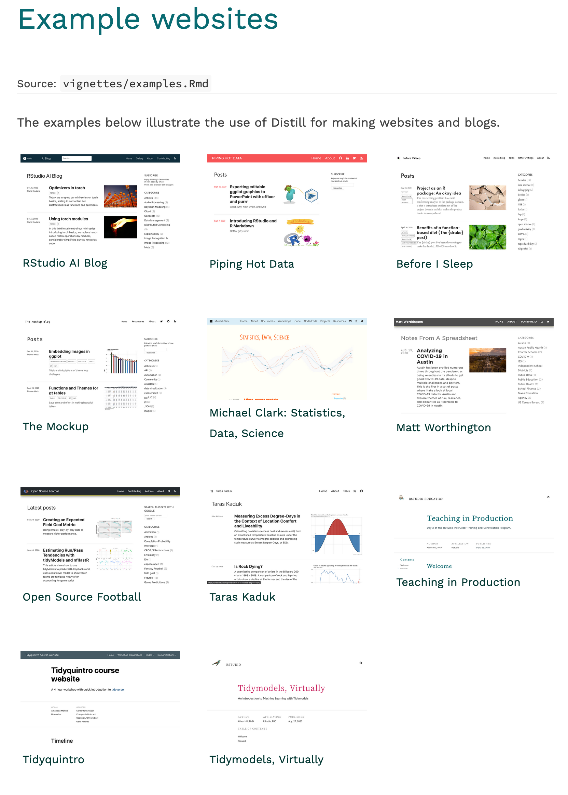
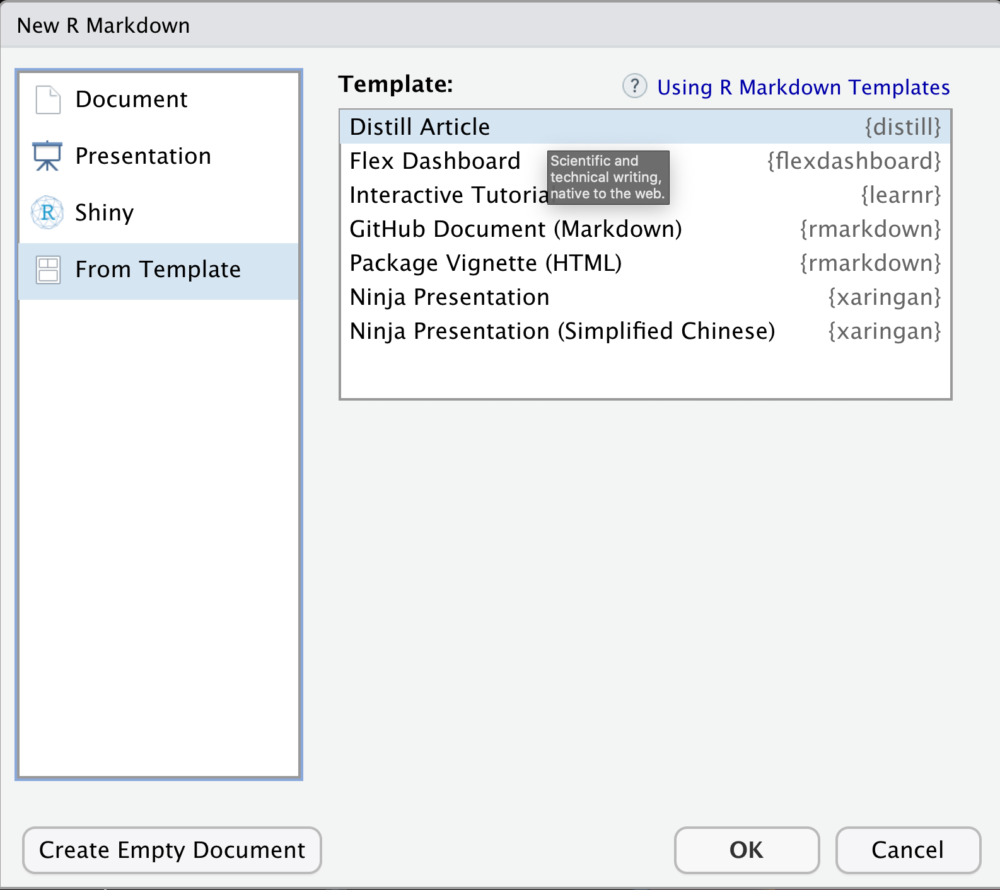

class: inverse

background-image: url(https://github.com/m-clark/m-clark.github.io/raw/master/img/Rlogo.svg)

```{r setup, include=FALSE}
options(htmltools.dir.version = FALSE, crayon.enabled = FALSE) # see https://github.com/hadley/mastering-shiny/issues/132

knitr::opts_chunk$set(
  # code
  echo      = F,
  eval      = F,
  message   = F,
  warning   = F,
  error     = F,
  comment   = NA,
  R.options = list(width = 220),
  # viz
  dev.args  = list(bg = 'transparent'),
  dev       = 'svglite',
  fig.align = 'center',
  out.width = '75%',
  fig.asp   = .75,
  # cache
  cache.rebuild = F,
  cache         = F
)

kable_df = function(data, digits=3, ...) {
  kableExtra::kable(
    data,
    digits = digits,
    format = 'html',
    booktabs = T,
    # longtable = F,
    linesep = "",
    ...,
  ) %>% 
    kableExtra::kable_styling(full_width = F)
}

perc = function(x, digits = 1) paste(rnd(x*100, digits = digits), '%')
```

```{r setup-extra, echo=FALSE, eval=TRUE}
xaringanExtra::use_xaringan_extra(
  c(
    "tile_view",
    "animate_css",
    "tachyons",
    'clipboard',
    'fit_screen',
    'webcam',
    'panelset'
  )
)

xaringanExtra::use_logo(
  image_url = 'https://raw.githubusercontent.com/m-clark/m-clark.github.io/master/img/mc_logo.png',
  link_url = 'https://m-clark.github.io',
  width = '5%',
  position =  xaringanExtra::css_position(bottom = "-3em", left = "1em"),
  exclude_class = c("title-slide")
)

xaringanExtra::use_animate_css()

xaringanExtra::style_share_again(
  share_buttons = c("twitter", "linkedin", "pocket")
)
```


```{r load-packs, include=FALSE, eval=TRUE}
library(tidyverse)
library(plotly)
library(visibly)
library(scico)
```


---
class: inverse middle center


### **Overview**
### **Basic Article**
### **Features**
### **Visualization**
### **Building a Website**


---
class: inverse middle center animated rollIn rollOut # https://animate.style/


# What is Distill?


```{r out.width='75%', eval=TRUE}
knitr::include_graphics('img/RMarkdownOutputFormats.png')
```


---
class: inverse

# Basics

From RStudio:

> Distill for R Markdown is a web publishing format optimized for scientific and technical communication


> Features essential to technical writing like LaTeX math, citations, and footnotes.


> Flexible figure layout options (e.g. displaying figures at a larger width than the article text).


> A variety of ways to publish articles, including support for publishing sets of articles as a Distill website or as a Distill blog.


---
class: inverse

# Examples


```{r out.width='75%', eval=TRUE}

```


---
class: inverse 

# Basics


All you have to do to get started is install the package...

```{r install, echo=T}
install.packages('distill')
```


---
class: inverse

# Basics

Now open up a new markdown via templates.

`File/New File/R Markdown/From Template/Distill Article`


```{r out.width='75%', eval=TRUE}

```

---
class: inverse 

# Starting Out


```
---
title: "My Amazing Article"
description: |
  Other cool stuff
author:
  - name: Michael Clark
    url: https://m-clark.github.io
    affiliation: CSCAR
    affiliation_url: https://cscar.research.umich.edu/
date: `r Sys.Date()`
output:
  distill::distill_article:
    toc: true
css: styles.css
---


```


---
class: inverse 

# Title


---
class: inverse 

# Title


---
class: inverse 

# Title


---
class: inverse 

# Title


---
class: inverse 

# Features I like

- Asides
- Nice citations
- Interesting figure layout


